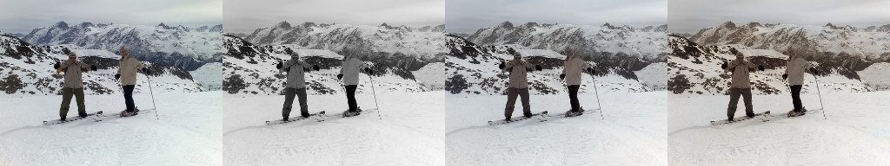
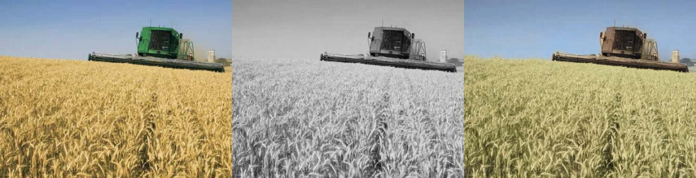
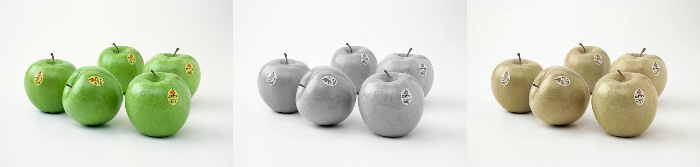
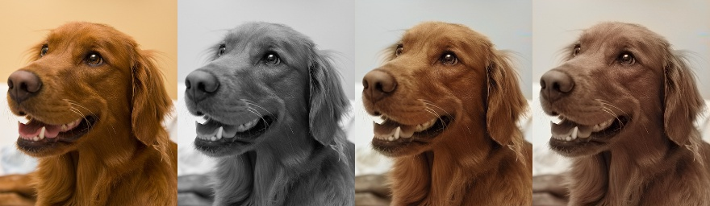
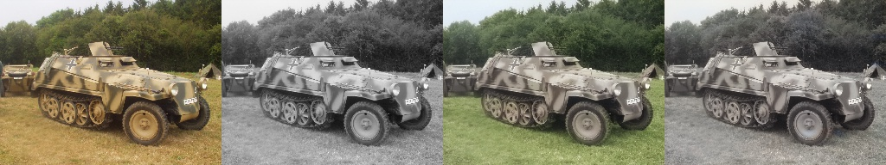
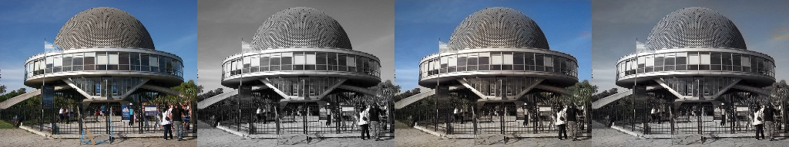

# Colorization

In this project I colorize black-and-white images with the help of neural networks. I started it as a research project
for the University Esslingen but try to further maintain and develop it.

It started in 2019 with a U-Net and L1/L2 loss. The code from then is written in Tensorflow 1/Keras. You still find that
code on the master branch.

This branch is a rewrite in Pytorch.

## Example Results

3 Images are [GT, BW, Prediction]  
4 Images are [GT, BW, Prediction, Prediction - but input was smoothed with a gaussian kernel]









Net: InceptionResnetV2U-NetAttention,  
Loss: L2W+CCL-euclidean, weights: alpha 1, ccl_lambda 1  
SLIC: 100 segments, compactness 5, 10 iterations  
LR 3e-4  
BS 16  
Trainings images were 256x256

## Prerequisites

**Development dependencies:**

```
conda install pytorch==1.8.1 torchvision torchaudio cudatoolkit=11.1 -c pytorch -c conda-forge
conda install numpy ninja pyyaml mkl mkl-include setuptools cmake cffi typing_extensions future six requests dataclasses
conda install -c conda-forge opencv jupyterlab albumentations matplotlib torchvision
conda install tqdm protobuf
pip install python-magic segmentation-models-pytorch
```

I work with a self compiled Pytorch to get the latest Cudnn support, but it should not make a difference if you use the
same Pytorch version from the official release channels. The currently included CuDNN 8.0.0 has poor support for Ampere
GPUs.

Install **CUDA_SLIC**:

```
PATH=/usr/local/cuda-11/bin:$PATH CUDA_INC_DIR=/usr/local/cuda-11/include pip install cuda-slic
```

**Doc dependencies:**

```bash
pip install sphinx_rtd_theme
```

## Data preparation

I use the ImageNet dataset. You can leave the default ILSVRC folder structure. The data loaders search for images in the
specified folder (eg `ILSVRC/Data/CLS-LOC/train`) and all subfolders. By default the test and val folders are containing
images while train contains folders that contain images.

For the Color Consistency Loss you have to create the segmentation masks in advance. See the section below.

## Training

```
usage: main.py train [-h] [--images path] [--val_images path] [--segment_masks path] [--val_segment_masks path] [--backbone BACKBONE] [--head_type HEAD_TYPE] [--loss selection] [--lambda_ccl value] [--ccl_version selection]
                     [--lr value] [--alpha value] [--gamma value] [--regularization_l2 value] [--momentum value] [--optimizer selection] --iterations value [--val_iterations value] [--warmup iterations]
                     [--milestones [iterations [iterations ...]]] --growing_parameters path [--debug]
                     path path

positional arguments:
  path                  path to output model or checkpoint to resume from
  path                  path transform.py

optional arguments:
  -h, --help            show this help message and exit
  --images path         path to images
  --val_images path     path to images
  --segment_masks path  path to images
  --val_segment_masks path
                        path to images
  --backbone BACKBONE   backbone model
  --head_type HEAD_TYPE
                        head type
  --loss selection
  --lambda_ccl value
  --ccl_version selection
  --lr value            Learning rate
  --alpha value         Weighting factor alpha
  --gamma value         Weighting factor gamma
  --regularization_l2 value, -reg_l2 value
                        Weight regularization
  --momentum value      SGD Optimizer Momentum
  --optimizer selection
                        The Optimizer
  --iterations value, -iters value
                        How many mini batches
  --val_iterations value, -val_iters value
                        Validation run after how many mini batches
  --warmup iterations   numer of warmup iterations
  --milestones [iterations [iterations ...]]
                        List of iteration indices where learning rate decays
  --growing_parameters path
                        Json file with the params fpr batch size and image size
  --debug               No shuffle
```

Example:

```bash
python -m colorization.main --verbose train Resnext50_UNet.pth \
    transform.py \
    --backbone Resnext50_UNet \
    --images /mnt/data/datasets/ILSVRC2017_CLS-LOC/ILSVRC/Data/CLS-LOC/train \
    --val_images /mnt/data/datasets/ILSVRC2017_CLS-LOC/ILSVRC/Data/CLS-LOC/val \
    --lr 0.0003 \
    --growing_parameters growing_parameters.json \
    --iterations 70000 \
    --milestones 30000 55000 \
    --warmup 3000 \
    --val_iterations 3500
    
```

Examples for [growing_parameters.json](resources/growing_parameters.json) and
[transform.py](resources/transform.py) are in the resources folder.

Growing parameters lets you define a batch size and image size starting from an iteration:  
Elements are: `"iteration": [batch_size, width, height]`.

```
{
	"0": [128, 128, 128],
	"10000": [64, 256, 256]
}
```

## Inference / Testing

```
usage: main.py infer [-h] [--images path] [--target_path path] [--batch_size value] [--img_limit value] [--debug] [--transform path] model

positional arguments:
  model               path to output model or checkpoint to resume from

optional arguments:
  -h, --help          show this help message and exit
  --images path       path to images
  --target_path path  path to images
  --batch_size value  Batch size
  --img_limit value   Only first N images in the folder
  --debug             Stich original image, grey and predicted together
  --transform path    Python file with a transform function
```

## Generate Color Segmentation Masks

### SLIC Superpixels

I use a CUDA SLIC implementation to speed up the process.

After you installed the package with pip (see above) you run the creation like this:

`PATH=/usr/local/cuda-11/bin:$PATH CUDA_INC_DIR=/usr/local/cuda-11/include python utils/create_slic_segments_multi.py`

To change the hyperparameters for the SLIC algorithm alter them inside the script.

### Linear colour segmentation revisited [Deprecated]

From the
paper [Linear colour segmentation revisited, Smagina et al., 2019, SPIE](https://spie.org/Publications/Proceedings/Paper/10.1117/12.2523007?SSO=1)
.

The segmentation masks I use are rather large, about 20 areas per image.

I [forked](https://github.com/dketterer/colorsegmentation) their repo and fixed some issues to make it compatible with
OpenCV 4.2.

See [utils/create_color_segments_multi.py](utils/create_color_segements_multi.py) for the usage.

```
python3 utils/create_color_segements_multi.py
```

## Unittest

Run the unittests from the top level directory:

```bash
python -m unittest
```

## Build the docs

```bash
cd docs
make html
```