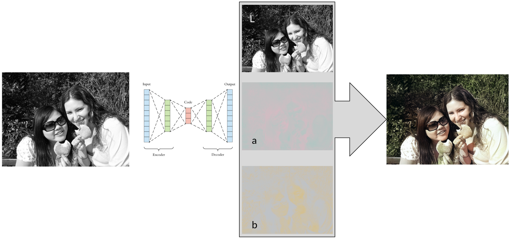
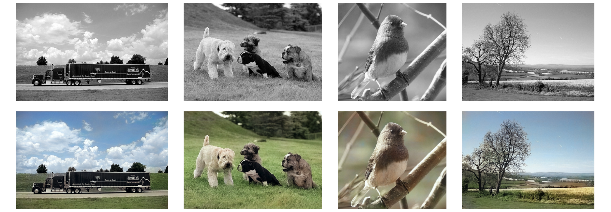

# Colorization

In this project I colorize black-and-white images with the help of neural networks.
I started it as a research project for the University Esslingen but try to further maintain and develop it.  
The repository contains the code to train and run a colorization U-Net.

**There is an ongoing rewrite in pytorch in a separate [branch](https://github.com/dketterer/colorization/tree/pytorch-rewrite).**




## Examples

Here are some examples from the validation set:



My scientific [report](docs/Scientific%20Report%20of%20the%20Colorization%20Project.pdf) for the university and a 
[presentation](docs/Presentation:%20Colorization%20of%20black-and-white%20images%20with%20Deep%20Learning.pdf) can be 
found in the docs directory.


## Prerequisites

Machine needs a Nvidia GPU with installed drivers and CUDA 10.0 (for Tensorflow 1.14).  
Otherwise install the non gpu version of tensorflow and work on the CPU.

- Create a virtual environment: `virtualenv -p python3.7 <venv>` 
- Install the dependencies: `pip install -r requirements.txt`

## Training

Images and validation images need to be in the specified directory or in a direct subdirectory.  
The default models were trained with the option "large" and "alt_model".

```
usage: train.py [-h] [--weights WEIGHTS] [--image_size IMAGE_SIZE]
                [--epochs EPOCHS] [--batch_size BATCH_SIZE] [--plot PLOT]
                [--large] [--alt_model]
                images val_images log_dir {l1,l2}

positional arguments:
  images                Read training images from this dir and its sub-dirs.
                        Supported file exts: .jpg, .jpeg .JPG .JPEG
  val_images            Read validation images from this dir and its sub-dirs.
                        Supported file exts: .jpg, .jpeg .JPG .JPEG
  log_dir               Log the tensorboard file, checkpoints, final weights
                        and a trained model to this dir
  {l1,l2}               The loss function

optional arguments:
  -h, --help            show this help message and exit
  --weights WEIGHTS     Load this weight file and train on top of it. Read the
                        epoch number and train the difference to "epochs"
                        (default: None)
  --image_size IMAGE_SIZE
                        One value for width and height of the resized training
                        inputs (default: 256)
  --epochs EPOCHS       Number of epochs the model shall be trained afterwards
                        (default: 4)
  --batch_size BATCH_SIZE
                        Training batch size (default: 8)
  --plot PLOT           Write image of the model architecture to this png file
                        (default: None)
  --large               Use 64 filters in the first conv block not 32, and so
                        on (default: False)
  --alt_model           Use the model from the keras-unet package instead of
                        the self-defined (default: False)
```

## Testing

**Trained weights can be found under the releases tab.**

The two notebooks Test_Directory and testing_notebook can be used to run inference.

Test_Directory espacially can be used to run inference on a whole directory of images. 
The Results are visualized next to the original and gray-scale image.

The testing_notebooks gives further insides in single images. You can visualize the predicted
a and b channels.

## Histograms

The Histogram notebook makes histograms from a directory of images. Number of images is currently 
limited by RAM of the running computer.
